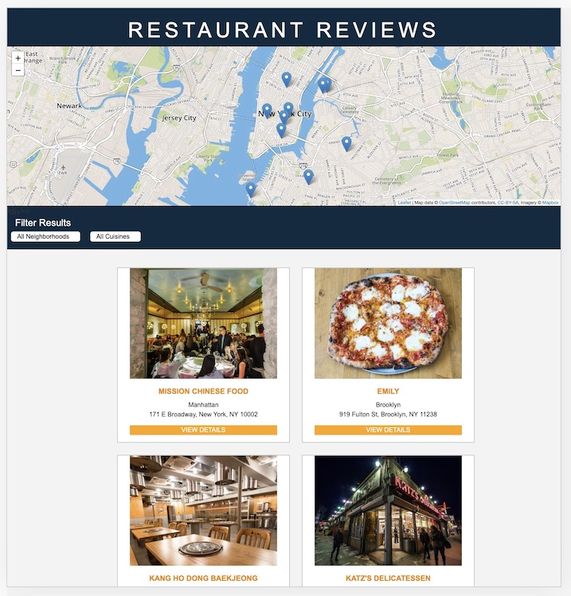

# Restaurant Reviews App: Udacity Project 5
The goal of this project is to take a static restaurant reviews app and revise it to be responsive and accessible. The project consists of three phases:
1. Convert the static app to a responsive design.
2. Implement accessibility features and Aria roles in the HTML.
3. Implement a service worker to cache responses to requests for site assets and render visited pages when there is no network access.

## To View or Use the App:

### Download the files from GitHub to your computer
1. Click the green _Clone or download_ button on GitHub.
2. Select *Download ZIP*.
3. Open your Downloads folder and right-click the ZIP file.
4. Select either the _Unzip_ or _Uncompress_ option. Then select the folder to which you want to save the files.

### Fork the repository to your own GitHub account
1. Create a GitHub account if you don't already have one.
2. Click the *Fork* link near the top right of my GitHub repository.
3. The files will be forked to your GitHub repository.

### Fork the repository to your own GitHub account
From inside the new directory you created, invoke terminal and launch a local client server using Python: 
 * Python 2: python -m SimpleHTTPServer 8000 
 * Python 3: python3 -m http.server 8000
Visit the site in your browser at http://localhost:8000

## UX Design Samples:

### Mobile view (Nexus 5):

### Laptop/desktop view:

## Languages and Resources Used
* HTML, CSS, and JavaScript
* Starter code from Udacity
